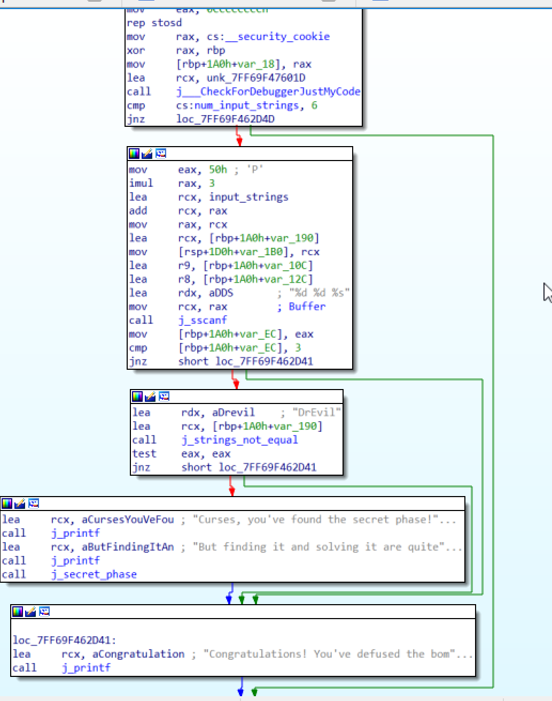

# executing bomb file

 It waits me to enter the first i/p. When I enter random string it closes(bomb explodes).

# using IDA

* ## watching functions names

  * We have the main function, six phases and a secret phase.

* ## main function
  
  * Lets put a breakpoint at the main function.
  * We have two printf functions that prints the massages that we saw when we run the exe file and there is call instruction that asks me to enter the first I/p.  
  * Before each phase we have a call that calls the "j_read_line" function which askes us to enter the inputs before each phase. 
  * Lets put a random string (iabc) when I do that the command window close itself we need to scroll in "phase_1" function (we will do that with each phase).

* ## phase 1

  * Lets put a breakpoint at "j_phase_1" function.
  * There is an address that moved to RDX registers, a value that moved to RCX, a call function, the test and jump instruction. After the check we have two paths one that explodes the bomb and one that defuses it.
  * The call instruction calls a function that called "strings_not_equal" I can guess that it checks what are the values inside the last registers.
  * RCX stores the first digit that we entered and RDX stores a strange string. We should try the string that was stored in RDX as an input.  
  * Entering this string will defuse the bomb.
  * The first input is: "I am just a renegade hockey mom."

* ## phase 2
  
  * Lets put a breakpoint at "j_phase_2" function.
  * Lets go deep into "j_phase_2" function. After entering the I/P we will find that it was stored in RAX register then it moved to RCX.
  * Inside read_six_numbers function(that is mean the second I/P should be six numbers):
    * In this function we can find that RCX stores our input.
    * RDX waits six integers 
  * Lets change the I/P to "0 1 2 3 4 5".
  * There is a comparison between 0 which is my first I/P with 1 that is mean the first digit in my I/P should be 1.
  * Making the first digit as 1 will not explode the bomb. After some instruction it will check if 1 is greater than or equal to 6  if not it will compare the second digit with ECX which is 2 that is mean the second digit should be 2. After few instruction it increments RAX by 1. In this program it deals with RAX as counter it checks the number of digits if it is less than 6 it continues checking and if it greater than or equal to 6 it defuses the bomb.
  * It checks if 2 is greater than or equal to 6 if not it will compare the third digit with ECX which equals to 4 and so on. My third digit was 3 so the bomb will explode.
  * How to know the required digits? the key is 
  the shift lift instruction will MUL ECX by 2. That is mean it will MUL 2(second digit) by 2 = 4(third digit), 4 by 2 = 8(fourth digit) and so on.
  * What about the first digit? it checks the first digit before going to this loop.
  * The second input is: "1 2 4 8 16 32"

* ## phase 3

  * lets put a breakpoint at "j_phase_3" function. It will ask me to enter I/P I will enter "1 2 3 4 5 6".
  * In the function I found that we should enter not less than two integer numbers to avoid the explosion.
  * First integer should be less than 7.
  * [rbp+150h+var_10C] the value in this memory should be equal to the second value that I entered. I will try the numbers between 0 and 4 as the first integer. Why between 0 and 4? because of
  * In this phase we have switch in this switch there is an arithmetic operations so we should decide which case we want to enter (using the first INT) then decide the second value that I should enter(decide it by seeing what value will the switch produce).
  * The third input is: "0 602(25Ah)" in this phase u can have another answers.

* ## phase 4
  
  * lets put a breakpoint at "j_phase_4" function. First I will go into the function. I will enter two integers as I/P.
  * First operand should be between 0 and 13.  to determine the value u should understand what is happening in "j_func4" function and I was not able to understand it But u can try all values between 0 and 13 and the value that make [rbp+170h+var_12C] equal to Ah(10 in decimal) is the correct value.
  * Second operand should be 10 because of 
  * The fourth input is: "3 10".

* ## phase 5

  * lets put a breakpoint at "j_phase_5" function.
  * Firstly I will go to see the assembly instructions. I should enter 2 operands 
  * To get the first operand we should understand this loop.  First thing we should enter this loop 15 times  to make [rbp+190h+var_12C] equal to Fh(15 in decimal). 
  * To get the second operand we should know what value was stored in [rbp+190h+var_16C]  it will be 73h = 115 in decimal.
  * The fifth input is: "5 115"

* ## phase 6

  * First thing we should do is to add a breakpoint to this phase. 
  * Entering the phase by double clicking on its name. It needs six numbers as an input. 
  * here it checks if there is repeated numbers  if not it goes back to  until it reaches to number 6 (the last operand).
  * Here it checks the nodes we can get the nodes valued from here (that is mean we are in a linked list).  
  * How to get the nodes values? here the value of node four is 0393h 
  * Here it is comparing each node to the rest of nodes with each other (1st with 2nd, 2nd with 3rd and so on). The first value should be greater than the second one.  
  * The sixth input is: "5 4 3 1 6 2" (node1=212h , node2= 1C2h , node3=215h , node4=393h , node5=3A7h and node6=200h).

* ## secret phase

  * First I want to know where is this phase? 
    * I will double click on its name.
    * Right click on "secret_phase" and select Xrefs graph from. 
  * I will go to "phase_defused" and see how to enter to secret_phase  to enter the phase I need to finish the first six phases first.
  * When u step into phase_defused u will see that RCX stores 3 10 which is the answer for phase 4 and after few lines u can see it needs 2 numbers and one string which are 3 10 DrEvil  (which we can see in the next block if u entered any other string u will go to the next block but u will go out to the end of the code when u execute the test inst). 
  * Now I will step into the secret_phase function. 
  * It askes for an input I will enter " 1001 1 2 3 4 ".
  * From these two CMP instructions we can say my input should be more than or equal one digit and the first digit <= 1001(3E9h).
  * To know why the first input I entered was fault I will step into "fun7".
  * fun7 is the answer key because the O/P that come from fun7 should be equal to 5 (EAX = 5).
  * the key in fun7 is the ns n1,n21,n22,.....to n48(these are values for a tree).
  * First thing we should know that the block on the lift MUL EAX with 2 and the one on the middle make EAX=0 and the one on the right adds some value to EAX(add 1 then 3 then ...). 
  * First step we should enter the block on the right(EAX = 1), second step we should MUL it with 2(EAX = 2) then we should enter the third block(EAX will be =5) how can we do that?
    * 1- u should know the values of ns to get it u should double click n1  then u will find the ns (go up to see the rest) .
    * 2- the program compares only one n from n1 one n from n2 one n from n3 one n from n4(i think it is something like a tree that has branches).
    * 3- We should not enter fun 7 more than  4 times why? because if we did that EAX will be 0FFFFFFFFh to do that our input should equal to one value of n4s.
    * 4- To enter the block on the right my I/P should be >= 24h then to enter the box on the lift my I/P should be < 32h finally to enter the box on the right again my I/P should be >= 2Dh.
    * 5- The value in n4 should be > 24h and < 32h and > 2Dh the value is 2F.
  * The answer is: "47(2Fh)"